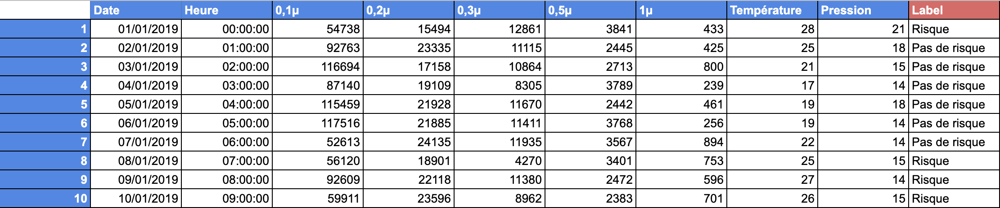

# Voltron: Spécification technique pour la surveillance des conditions sanitaire d'un bloc opératoire 

## Pré Voltron

Objectif: 

Mise en place d’un processus technique réutilisable d’un projet à l’autre.

Contexte :

Réfléchir à l’intégration de notre solution au sein d’une solution mère.
Efficacité, gain de temps, adaptabilité de notre solution.
Faciliter la prise en main : ergonomie, documentation.

Tools :

Google colab
Permet de travailler à plusieurs.
Utilisation de GPU distant.
Gratuit.
Tensorflow Keras - Random Forest 
Choix de l’algo :
mise en contexte.
algo “rentable” : rapport coût / bénéfice avantageux.

On part du principe que ce sera à l’équipe Big Data de faire le pont entre nous et la bdd, en nous transmettant un dataset exploitable mais sur lequel nous ferons du preprocessing :
labelisation selon le cas
création des jeux d’entraînements / de tests
data augmentation
data normalisation / standardisation / mise à l’échelle
keras imagedatagenerator
numpy
...

Interface avec les autres corps de métiers permettant de récupérer les données et les formater si besoin au format HDF5. Et transmettrons au format désiré (potentiellement un JSON). Schéma de l’archi de notre projet avec format des données qui transitent

Visualisation des résultats des modèles pour faire le meilleur choix technique (plotly, seaborn, …) 

Interface JS pour visualiser les résultats et gérer l’IA.

ML pré-entraînées pour résoudre les différents problèmes efficacement.

Une documentation qui aide la team IA à sélectionner le modèle le plus adapté à la problématique. 

Amélioration possible: Une IA qui sélectionne quel modèle utiliser en analysant le jeu de données récupéré. (potentiellement juste une suggestion sur l’interface JS)

Nous voulons travailler avec des environnements virtuels identiques. L’utilisation de conda nous paraît bonne mais si l’équipe devops a des propositions, nous restons ouverts.

Documentation : Docusaurus.

## PROJECT HEALTH TECH

Les conditions d'hygiène doivent être impeccables pour toutes les interventions, quelle qu'elles soient. Le but étant que les opérations se passent dans des conditions sanitaires optimales. Pour cela, nos blocs opératoires doivent suivre les directives nous permettant d'obtenir ***une salle blanche/propre de classe ISO 5 au moins***.

#### Salle propre: Définition

> Salle dans laquelle la concentration des particules en suspension dans l'air est maîtrisée et qui est construite et utilisée de façon à minimiser l'introduction, la production et la rétention des particules à l'intérieur de la pièce et dans laquelle d'autres paramètres pertinents, tels que la température, l'humidité et la pression sont maîtrisés comme il convient

### Salle propre de classification ISO 5:

Pour définir si un bloc opératoire est classer comme salle blanche de classe ISO 5 il faut donc pouvoir mesurer et contrôler le nombre de particules par m3. Pour se faire il nous faut des capteurs permettant de mesurer la concentration en particules de tailles différentes. 
Pour connaitre les concentrations maximales admissibles (en particules/m3 d'air) par tailles de particules, il est nécessaire de se référer à la [classification ISO 14644-1](https://www.iso.org/fr/standard/53394.html): 

| 0,1µ    | 0,2µ   | 0,3µ   | 0,5µ  | 1µ  | 5µ |
|---------|--------|--------|-------|-----|----|
| 100 000 | 23 700 | 10 200 | 3 520 | 832 | -  |

> Par exemple pour qu'un bloc opératoire soit classer comme salle propre, il faut que lors de la mesure on retrouve moins de 100 000 particules d'une taille supérieur ou égale à 0,1 µ mètre. 

### La température d'un bloc opératoire 

> La température du bloc opératoire doit être comprise en 19°C et 26°C (Norme hospitalière : NFS 90-351 d’Avril 2013).
> 

### Les zones à risques (par niveau de risque)

| Niveau | Risque infectieux           |
|--------|-----------------------------|
| 4      | Très haut risque infectieux |
| 3      | Haut risque infectieux      |
| 2      | Risque infectieux moyen     |
| 1      | Risque infectieux nul       |

### Indicateurs qualité de l'air en fonction de la classe de risque

| Classe de risque | Classification ISO 14644-1 | Pression différentielle | Plage de température |
|------------------|----------------------------|-------------------------|----------------------|
| 4                | ISO 5                      | 15 Pa (+ 5 Pa)          | 19 à 26 C            |
| 3                | ISO 6                      | 15 Pa (+ 5 Pa)          | 19 à 26 C            |
| 2                | ISO 7                      | 15 Pa (+ 5 Pa)          | 19 à 26 C            |

### Résumé 

Pour qu'un bloc opératoire soit considéré comme salle propre: 

+ On doit pouvoir mesurer et contrôler le nombre de micro-particules par m3 
+ Cette concentration doit être en dessous des concentrations maximales admissibles par taille de particules ( de 0,1 à 5 µ ) 
+ La pression différentielle doit être de 15 Pa (+ Pa) 
+ La tempérture du bloc doit être comprise en tre 19 et 26°
+ Si ces conditions sont remplies, on peut dire que le niveau de risque infectieux est égal ou inférieur à 4 (Norme NFS -90-351)

## Model de donnée 

Pour concevoir notre solution technique nous allons avoir besoin de mesurer certaines caractéristiques et récolter des données qui vont nous permettre de déterminer si un bloc opératoire est aux normes et opérationnel. 

Pour se faire nous allons devoir mesurer différents paramètres: 

+ la pression (Pa)
+ la température (°C)
+ la concentration en CO2 (%)
+ l'humidité (%)
+ La concentration en micro particules par m3 (nb micro particules / m3 d'air / taille de particule)

## Proposition IA 

### Le problème

Un bloc opératoire doit proposer des conditions d'hygiène irréprochable pour pouvoir traiter et soigner les patients dans les meilleurs condition en évitant le risque de contamination par les particules et microorganismes présent dans l'air. Pour qu'un bloc opératoire soit considéré comme opérationnel et que l'on puisse autoriser une intervention en son sein, celui ci doit être catégorisé comme "salle blanche" et répondre à un certain cahier des charges. Ces mesures concernent: 

+ la pression (Pa)
+ la température (°C)
+ la concentration en CO2 (ppm)
+ l'humidité (%)
+ La concentration en micro particules par m3 (nb micro particules / m3 d'air / taille de particule)

Si les données mesurées correspondent aux différents seuil attendu pour respecter les caractéristiques d'une salle blanches (au moins le niveau pour les salles de norme IS05). On pourra dire que le bloc opératoire est dans les conditions d'hygiènes minimale attendu pour autorisé son utilisation, sinon il ne l'est pas et on ne pourra pas le proposer à l'équipe soignante. On pourra donc rediriger une équipe d'entretien ou de maintenance pour mettre le bloc opératoire dans les bonnes conditions et pouvoir le re-proposer à l'équipe médicale le plus rapidement possible. 

### Les données 

Le dataset va être sous la forme d'un fichier csv qui contient différentes mesures de ces données (pression, température, humidité, ...) mais également nous allons retrouver une notion de temps (date et heure). Chaque ensemble de mesure sera associé à un label: "risque" / "pas de risque". 

Ce label est défini en mesurant si les valeurs pour chaques paramètres sont en dessous du seuil attendu pour respecter la norme (salle blanche/propre). 

#### Compte rendu échange avec l'équipe sur la génération du mock des donées 

>[16:38] Youness Bennaj
>🚨🚨🚨🚨🚨 Team IA - Team Big Data 🚨🚨🚨🚨🚨

>Voici un début de solution pour la génération des données sous forme d'un csv ça sera plus simple (nicolas >desmares tu pourras le mettre dans le rendu pour ce soir).

>L'idée est la suivante: 

>On va générer des fausses données mesurées dans un bloc opératoire grâce à des valeurs aléatoires selon les >caractéristiques suivantes:  

	
>la pression (Pa)
>la température (°C)
>la concentration en CO2 (%)
>l'humidité (%)
>La concentration en micro particules par m3 (nb micro particules / m3 d'air / taille de particule)

>Mais pour pas faire n'importe quoi on va générer une valeur aléatoire qui autour du seuil attendu pour que la salle soit au norme. Voici un exemple: 

>Pour les micro particules de 0,1 micro-mètre, le seuil est à 100 000 particules (il faut moins de 100 000 particules pour être au norme). Du coup ma formule pour gérer un nombre random dans cette colonne va être: "=RANDBETWEEN(50000;120000)". Et on fait ça pour les autres tailles de particules, la température, etc 

>Là je laisse team big data finir le fichier avec ce que j'ai déjà fait, il manque la concentration en CO2 et l'humdité donc si vous pouvez trouver les valeurs de seuil pour ces mesures et générer les bons nombres svp. 

>Enfin il restera à labelisé chaque jeu de donnée, c'est à dire que pour chaque ensemble de mesure (particules, humidité, pression, ...) faut y associer un label: "pas de risque" ou "risque". Pour se faire faudrait une formule qui va vérifier si chaque valeur correpond bien au seuil attendu pour être au norme (voir mon fichier sur les normes et salles blanches + vos recherches)

#### Un extrait du csv

### Le model de ML 

L'objectif pour l'équipe IA va être de mettre en place un modèle de machine learning capable de prédire pour une date à venir si il y'a un risque que certain bloc de soit pas opérationnel et pouvoir prévenir ce risque en amont et faire intervenir une equipe de maintenance.

### Les modèles de ML qui vont être exploré 

+ Linear regression
+ Random forest 
+ Support vector machine

### Possibilité d'amélioration du modèle

Par la suite on pourra améliorer notre modèle de ML pour pouvoir prédire quel paramètre fera défaut. 

